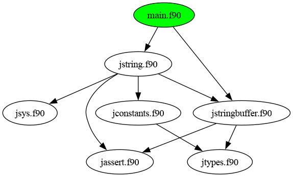

# ezf

**E**a**z**ily compile and run **F**ortran programs.

`ezf` is a tool that makes it easy to compile and launch a Fortran program. The program to be compiled can use several modules.
Modules can be in the same file, in the current directory and/or in the `src/` subdirectory.
The script tries to compile the source files (and the imported modules) in the correct order.

`*.mod` files are stored in a separate subdirectory: `mod/`.

## Rationale

In Java, when your project consists of several files, it's enough to compile just the main file (`javac Main.java`),
and the compiler will find and compile all the necessary sources. D Lang. has a similar feature: when you compile
the main file with the `-i` switch (`dmd -i main.d`), all
the necessary modules are compiled.

I wanted something similar for Fortran. I have a simple
project, I use some modules, and I want to be able to
compile the project easily. I only want to specify the
main file, nothing else.

If you work on a larger project, you should use
[fpm](https://github.com/fortran-lang/fpm), the Fortran
Package Manager. However, for very simple projects,
I find fpm to be an overkill.

## Help

```
$ ezf --help
ezf - easily compile and run Fortran programs

Usage: ezf [options] main.f90 [-- arguments]
Options:
-h, --help          this help
-i, --info          show all info (don't compile; don't run)
-c                  compile
-r                  run
-cr                 compile and run (default if no options are given)
```

* *options* are for the script
* *arguments* are passed to the program to be compiled in the form of command-line arguments

## Examples

```
$ cd demo1
$ ezf main.f90
# gfortran -Jmod -Imod src/jtypes.f90 src/jassert.f90 src/jstringbuffer.f90 src/jconstants.f90 src/jsys.f90 src/jstring.f90 main.f90 && ./a.out
```

It's enough to provide the name of the main file. The default
operation is compile & run. The script discovers the
dependencies among the used modules, and compiles them in the correct order. At the end, the compiled executable is
launched.

```
$ cd demo3
$ ezf main.f90 -- aa 2026 bb END
# gfortran -Jmod -Imod jsys.f90 main.f90 && ./a.out "aa" "2026" "bb" "END"
0: ./a.out
1: aa
2: 2026
3: bb
4: END
```

Arguments provided after "`--`" are passed to the program,
not to the script.


## Project discovery

The script can provide useful information about the
modules of the project.

```
$ ezf -i main.f90
Dependencies:
=============
{'jconstants.f90': ['jtypes.f90'],
 'jstring.f90': ['jconstants.f90',
                 'jassert.f90',
                 'jsys.f90',
                 'jstringbuffer.f90'],
 'jstringbuffer.f90': ['jtypes.f90', 'jassert.f90'],
 'main.f90': ['jstringbuffer.f90', 'jstring.f90']}
---
Dependency graph visualization:
===============================
See `deps.png`
# dot -T png deps.dot -o deps.png
```

Dependencies are visualized with [graphviz](https://graphviz.org/):

<p align="center">
  
</p>


```
Compilation order:
==================
['jtypes.f90', 'jassert.f90', 'jstringbuffer.f90', 'jconstants.f90', 'jsys.f90', 'jstring.f90', 'main.f90']
with paths:
['src/jtypes.f90', 'src/jassert.f90', 'src/jstringbuffer.f90', 'src/jconstants.f90', 'src/jsys.f90', 'src/jstring.f90', 'main.f90']
```

Correct compilation order is determined.

```
Unused source files:
====================
Maybe you can delete them?
['src/unused.f90']
```

Unused source files are listed. Useful if you copy over
a library that consists of several files but you use
just a subset of it.

```
Compile and run:
================
# gfortran -Jmod -Imod src/jtypes.f90 src/jassert.f90 src/jstringbuffer.f90 src/jconstants.f90 src/jsys.f90 src/jstring.f90 main.f90
# ./a.out
```

Compile (and run) instructions are printed on the screen.
They can be copied to a Makefile.

## Demos

You can find some demo projects here (see the `demo*/` folders).
They use my [jflib library](https://github.com/jabbalaci/jflib), which is under development.
These demos include an older version of this library. Check out
the GitHub page of [jflib](https://github.com/jabbalaci/jflib) for the newest version.

* `demo1` is the largest project, consisting of several modules
* `demo2` demonstrates that
  you can also use modules in the same file
* `demo3` demonstrates that you can pass command-line
  arguments to the program via the script

## Usage tips

It was tested under Linux only with the [gfortran](https://gcc.gnu.org/fortran/) compiler.

I suggest putting an alias on `ezf.py`,
and then you can call it easily.

Add this line to the end of your `~/.bashrc` file:

```
alias ezf="path/to/ezf.py"
```

`ezf` is written in a single file, and it uses just the
standard library of Python.

## Dependencies

* It was tested with the **gfortran** compiler only.
* For the graph visualization, install the **graphviz**
  package. (Under Arch-based distros: `sudo pacman -S graphviz`).
  This package is not obligatory though. If it's missing, you'll get just a warning.
